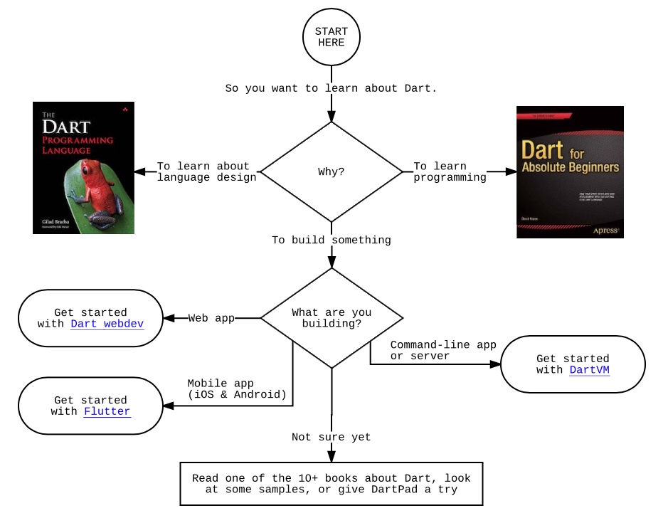

# Dart 快速预览

以下内容精简自[官方文档](http://dart.goodev.org/guides/language/language-tour#a-basic-dart-program一个最基本的-dart-程序)，添加了一些个人学习时的见解

## 简介
Dart 是谷歌在 2011 年推出的编程语言，是一门全平台的语言，不仅可以开发服务端，现在借助于 flutter 也可以开发原生 Android 和 iOS 应用。


## 示例

```
//声明方法
printNum(num aNum){
  //$变量值 
  print('The number is $aNum');
}

//main 作为程序入口
main(){
  //var 一种不指定类型声明变量的方式
  var num = 100;
  //调用方法printNum
  printNum(num);
}

```

## 关键字

几乎所有编程的关键字都差不多，不必刻意记，借助 IDE 的提醒即可规避。 
更多可参考 [关键字列表](https://www.dartlang.org/guides/language/language-tour#keywords)

## 变量

* 声明变量并赋值 

```
var name = 'alex';

```

* 声明变量不赋值默认为 null

```
int lineCount;
assert(lineCount == null);
```

* 声明具体类型的变量

```
String name = 'alex';
```

* final 和 const
final 定义的变量是运行时确定的值，只能在第一次初始化被赋值
const 定义的是在编译时就确定了值

## 内置类型
Dart 内置支持下面这些类型:

* numbers

| numbers 类型 | 解释 | 示例|
| --- | --- | --- |
| int | 整数值，其取值通常位于 -253 和 253 之间 | int num = 1; |
| double | 64-bit (双精度) 浮点数，符合 IEEE 754 标准 | double num = 1.0; |

* strings

| strings类型 | 解释 | 示例 |
| --- | --- | --- |
| String | UTF-16 编码的字符序列。 使用单引号或者双引号来创建 | String name = ‘alex’; |


* booleans

| booleans类型 | 解释 | 示例 |
| --- | --- | --- |
| true | 表示 bool 值的真 | bool bigger = (3 < 5);  |
| false | 表示 bool 值的假 | bool bigger = (3 > 5); |

**Dart 中， 只有 true 对象才被认为是 true，所有其他的值都是 flase。 例如：**

```
var name = 'Bob';
if (name) {
  // Dart will not print this line.
  print('You have a name!');
}
```

* lists (也被称之为 arrays)

| lists 类型 | 解释 | 示例 |
| --- | --- | --- |
| list | 有序集合(数组) | list shoppingList = [‘牛肉’，’萝卜’，'香菜’]; |

* maps

| maps | 解释 | 示例 |
| --- | --- | --- |
| Map | Map 是一个键值对相关的对象，键和值可以是任何类型的对象 | var dic = {'key':'value'}; |

* runes (用于在字符串中表示 Unicode 字符)
略


* symbols
略

## 方法

### 基本方法
Dart 一个方法的基本构成:

```
返回值类型 方法名(参数列表){
	方法体
}
```

例如:

```
bool isNoble(int atomicNumber) {
  return _nobleGases[atomicNumber] != null;
}
```

Dart 可以忽略类型定义

```
isNoble(atomicNumber) {
  return _nobleGases[atomicNumber] != null;
}
```

只有一个表达式的方法可以缩写为 胖尖头 语法 (个人不喜欢这种写法)

```
bool isNoble(int atomicNumber) => _nobleGases[atomicNumber] != null;
```

### 方法参数

* 基本方法参数

```
//指定位置，调用时候依参数位置顺序传入参数
callWithOrder(String name， String address){
  print('$name，$address');
}

//指定参数名字，调用时候传入对应的值
//可以理解为参数为一个 map
callWithKey({String name， String address}){
  print('$name，$address');
}

//将参数放到大括号中，来表示可选参数
callWithOptional(String name， String address， [int age]){
  print('$name，$address， $age');
}

//可选参数不传递，就使用方法声明时候的默认值
callWithDefaultValue({String name='alex'， String address = ''}) {
  print('$name，$address， $age');
}

main(){
  //指定位置，调用时候依参数位置顺序传入参数
  callWithOrder('alex'， '成都');

  //指定参数名字，调用时候传入对应的值
  //可以理解为参数为一个 map
  callWithKey(name: 'alex'， address: '成都');

  //将参数放到大括号中，来表示可选参数
  callWithOptional('alex'， '成都'， 28);

  //可选参数不传递，就使用方法声明时候的默认值
  callWithDefaultValue();
}
```

* main方法参数

程序的入口 void main() 方法有一个默认的参数列表， 即 List<String> arguments，同其它语言的 main 函数的 argv[] 一样， 可以传入参数启动程序 

```
void main(List<String> arguments){
	
}
```

* 一等方法对象(对象方法)
该实现类似 Map-reduce 的 Map 操作，即将所有对象进行方法的执行

```
printElement(element) {
  print(element);
}

var list = [1， 2， 3];
list.forEach(printElement);

```

### 匿名方法
声明的不带方法名字的方法我们称之为 lamda 或者 closure(闭包)
在括号之间可以定义一些参数，参数使用逗号分割，也可以是可选参数，后面大括号中的代码为函数体

```
//匿名方法格式
(参数列表) { 
  函数体; 
}; 

//匿名方法示例
var list = ['apples'， 'oranges'， 'grapes'， 'bananas'， 'plums'];
list.forEach((i) {
  print(list.indexOf(i).toString() + ': ' + i);
});
```

### 静态作用域

Dart 是静态作用域语言，变量的作用域在写代码的时候就确定过了。 基本上大括号里面定义的变量就只能在大括号里面访问，和 Java 作用域类似

### 词法闭包

一个闭包是一个方法对象，不管该对象在何处被调用，该对象都可以访问其作用域内的变量

### 测试函数是否相等

使用 == 来比较函数是否相等

### 返回值

所有的函数都返回一个值，如果没有指定返回值，则默认把语句 return null; 作为函数的最后一个语句执行


## 操作符
基本操作符同其它语言类似，此处略，下面说不同的几种操作符

### 类型判定操作符

**as**  类型转换符
**is**  判定是否为指定类型， 如果是返回 True
**is!** 判断是否为指定类型， 如果是返回 False

### 赋值操作符

使用 = 操作符来赋值。 但是还有一个 ??= 操作符用来指定值为 null 的变量的值
```
a = value;   // 给 a 变量赋值
b ??= value; // 如果 b 是 null，则赋值给 b；
             // 如果不是 null，则 b 的值保持不变
```
 
### 级联操作符   

级联操作符 (..) 可以在同一个对象上连续调用多个函数以及访问成员变量。使用级联操作符可以避免创建临时变量，并且写出来的代码看起来更加流畅

```
querySelector('#button') // Get an object.
  ..text = 'Confirm'   // Use its members.
  ..classes.add('important')
  ..onClick.listen((e) => window.alert('Confirmed!'));
```  
     
第一个方法 querySelector() 返回了一个 selector 对象。 后面的级联操作符都是调用这个对象的成员， 并忽略每个操作 所返回的值。

上面的代码和下面的代码功能一样    

```
var button = querySelector('#button');
button.text = 'Confirm';
button.classes.add('important');
button.onClick.listen((e) => window.alert('Confirmed!'));
```     
## 流程控制

大部分和其它语言基本一致，只说不太一样的

### Switch and case

Dart 可以支持同类型的 Switch，例如  integer、string、或者编译时常量，采用的是 == 来进行比较。

```
var command = 'OPEN';
switch (command) {
  case 'CLOSED':
    executeClosed();
    break;
  case 'PENDING':
    executePending();
    break;
  case 'APPROVED':
    executeApproved();
    break;
  case 'DENIED':
    executeDenied();
    break;
  case 'OPEN':
    executeOpen();
    break;
  default:
    executeUnknown();
}
```

## 类

### 基本简介
* Dart 是一个面向对象编程语言，所有的类都继承于 Object.

* 使用 new 关键字和构造函数来创建新的对象。 构造函数名字可以为 ClassName 或者 ClassName.identifier。例如：

```
var jsonData = JSON.decode('{"x":1， "y":2}');

// Create a Point using Point().
var p1 = new Point(2， 2);

// Create a Point using Point.fromJson().
var p2 = new Point.fromJson(jsonData);
```

* 使用点(.)来引用对象的变量或者方法

```
var p = new Point(2， 2);

// Set the value of the instance variable y.
p.y = 3;

// Get the value of y.
assert(p.y == 3);

// Invoke distanceTo() on p.
num distance = p.distanceTo(new Point(4， 4));
```

* 使用 ?. 来替代 . 可以避免当左边对象为 null 时候 抛出异常：

```
// If p is non-null， set its y value to 4.
p?.y = 4;
```

* 常量构造函数，使用常量构造函数 可以创建编译时常量，要使用常量构造函数只需要用 const 替代 new 即可

```
var a = const ImmutablePoint(1， 1);
var b = const ImmutablePoint(1， 1);

assert(identical(a， b)); // They are the same instance!
```

* 可以使用 Object 的 runtimeType 属性来判断实例 的类型，该属性 返回一个 Type 对象。

```
print('The type of a is ${a.runtimeType}');
```             

### Instance variables

* 所有没有初始化的变量值都是 null，每个实例变量都会自动生成一个 getter 方法（隐含的）。 Non-final 实例变量还会自动生成一个 setter 方法

```
//定义实例变量的示例。
class Point {
  num x; // Declare instance variable x， initially null.
  num y; // Declare y， initially null.
  num z = 0; // Declare z， initially 0.
}
```
### 构造函数

#### 普通构造函数

定义一个和类名字一样的方法就定义了一个构造函数，还可以带有其他可选的标识符

```
//常见的构造函数生成一个 对象的新实例，this 关键字指当前的实例
class Point {
  num x;
  num y;

  Point(num x， num y) {
    // There's a better way to do this， stay tuned.
    this.x = x;
    this.y = y;
  }
}
```

把构造函数参数赋值给实例变量的场景太常见了， Dart 提供了一个语法糖来简化这个操作

```
class Point {
  num x;
  num y;

  // Syntactic sugar for setting x and y
  // before the constructor body runs.
  Point(this.x， this.y);
}
```

如果你没有定义构造函数，则会有个默认构造函数。 默认构造函数没有参数，并且会调用超类的没有参数的构造函数
子类不会继承超类的构造函数，子类如果没有定义构造函数，则只有一个默认构造函数 （没有名字没有参数

#### 命名构造函数

Point.fromJson(Map json){} 就是一个命名构造函数

```
class Point {
  num x;
  num y;

  Point(this.x， this.y);

  // Named constructor
  Point.fromJson(Map json) {
    x = json['x'];
    y = json['y'];
  }
}
```

#### 重定向构造函数

有时候一个构造函数会调动类中的其他构造函数。 一个重定向构造函数是没有代码的，在构造函数声明后，使用冒号调用其他构造函数

```
class Point {
  num x;
  num y;

  // The main constructor for this class.
  Point(this.x， this.y);

  // Delegates to the main constructor.
  Point.alongXAxis(num x) : this(x， 0);
}
```

#### 常量构造函数

如果你的类提供一个状态不变的对象，你可以把这些对象 定义为编译时常量。要实现这个功能，需要定义一个 const 构造函数， 并且声明所有类的变量为 final

```
class ImmutablePoint {
  final num x;
  final num y;
  const ImmutablePoint(this.x， this.y);
  static final ImmutablePoint origin =
      const ImmutablePoint(0， 0);
}
```
#### 工厂方法构造函数

如果一个构造函数并不总是返回一个新的对象，则使用 factory 来定义 这个构造函数。例如，一个工厂构造函数 可能从缓存中获取一个实例并返回，或者 返回一个子类型的实例

```
class Logger {
  final String name;
  bool mute = false;

  // _cache is library-private， thanks to the _ in front
  // of its name.
  static final Map<String， Logger> _cache =
      <String， Logger>{};

  factory Logger(String name) {
    if (_cache.containsKey(name)) {
      return _cache[name];
    } else {
      final logger = new Logger._internal(name);
      _cache[name] = logger;
      return logger;
    }
  }

  Logger._internal(this.name);

  void log(String msg) {
    if (!mute) {
      print(msg);
    }
  }
}
```

### 函数
#### 实例函数
略

#### Getters and setters
略

#### 抽象函数

抽象函数是只定义函数接口但是没有实现的函数，由子类来 实现该函数。如果用分号来替代函数体则这个函数就是抽象函数

```
abstract class Doer {
  // ...Define instance variables and methods...

  void doSomething(); // Define an abstract method.
}

class EffectiveDoer extends Doer {
  void doSomething() {
    // ...Provide an implementation， so the method is not abstract here...
  }
}
```
 
#### 可覆写的操作符
略

### 抽象类

使用 abstract 修饰符定义一个抽象类，一个不能被实例化的类。 抽象类通常用来定义接口，以及部分实现

```
// This class is declared abstract and thus
// can't be instantiated.
abstract class AbstractContainer {
  // ...Define constructors， fields， methods...

  void updateChildren(); // Abstract method.
}
```

### 隐式接口

每个类都隐式的定义了一个包含所有实例成员的接口， 并且这个类实现了这个接口。如果你想创建类 A 来支持类B的 api，而不想继承B的实现， 则类 A 应该实现 B 的接口。

一个类可以通过 implements 关键字来实现一个或者多个接口， 并实现每个接口定义的 API

```
// A person. The implicit interface contains greet().
class Person {
  // In the interface， but visible only in this library.
  final _name;

  // Not in the interface， since this is a constructor.
  Person(this._name);

  // In the interface.
  String greet(who) => 'Hello， $who. I am $_name.';
}

// An implementation of the Person interface.
class Imposter implements Person {
  // We have to define this， but we don't use it.
  final _name = "";

  String greet(who) => 'Hi $who. Do you know who I am?';
}
```

### 扩展类

使用 extends 定义子类， supper 引用 超类：

```
class Television {
  void turnOn() {
    _illuminateDisplay();
    _activateIrSensor();
  }
  // ...
}

class SmartTelevision extends Television {
  void turnOn() {
    super.turnOn();
    _bootNetworkInterface();
    _initializeMemory();
    _upgradeApps();
  }
  // ...
}
```

子类可以覆写实例函数，使用 @override 注解来表明你的函数是想覆写超类的一个函数


### 枚举类型
使用 enum 关键字来定义枚举类型

```
enum Color {
  red，
  green，
  blue
}
```

枚举的 values 常量可以返回 所有的枚举值

```
List<Color> colors = Color.values;
assert(colors[2] == Color.blue);
```
### Adding features to a class: mixins
Mixins 是一种在多类继承中重用 一个类代码的方法。

使用 with 关键字后面为一个或者多个 mixin 名字来使用 mixin。


## 泛型

### 为什么使用泛型
在 Dart 中类型是可选的，你可以选择不用泛型。 有些情况下你可能想使用类型来表明你的意图， 不管是使用泛型还是 具体类型， 但在一些情况下， 可以不指定具体的类型让代码的限制更加宽泛化， 减少重复的代码.

### 使用集合字面量
参数化定义 list 需要在中括号之前 添加 <type> ， 定义 map 需要在大括号之前 添加 <keyType， valueType>。 如果你需要更加安全的类型检查，则可以使用 参数化定义，例如:

```
var names = <String>['Seth'， 'Kathy'， 'Lars'];
var pages = <String， String>{
  'index.html': 'Homepage'，
  'robots.txt': 'Hints for web robots'，
  'humans.txt': 'We are people， not machines'
};
```

### 限制泛型类型
使用 extends 可以实现对泛型类型的限制， 例如:

```
// T must be SomeBaseClass or one of its descendants.
class Foo<T extends SomeBaseClass> {...}

class Extender extends SomeBaseClass {...}

void main() {
  // It's OK to use SomeBaseClass or any of its subclasses inside <>.
  var someBaseClassFoo = new Foo<SomeBaseClass>();
  var extenderFoo = new Foo<Extender>();

  // It's also OK to use no <> at all.
  var foo = new Foo();

  // Specifying any non-SomeBaseClass type results in a warning and， in
  // checked mode， a runtime error.
  // var objectFoo = new Foo<Object>();
}
```

#### 使用泛型函数

```
T first<T>(List<T> ts) {
  // ...Do some initial work or error checking， then...
  T tmp ?= ts[0];
  // ...Do some additional checking or processing...
  return tmp;
}
```


## 库
### 导入
使用 import 来指定一个库如何使用另外 一个库

```
import 'dart:io';
import 'package:mylib/mylib.dart';
import 'package:utils/utils.dart';
```
### 指定库前缀
如果你导入的两个库具有冲突的标识符， 则你可以使用库的前缀来区分。 例如，如果 library1 和 library2 都有一个名字为 Element 的类， 你可以这样使用

```
import 'package:lib1/lib1.dart';
import 'package:lib2/lib2.dart' as lib2;
// ...
Element element1 = new Element();           // Uses Element from lib1.
lib2.Element element2 = new lib2.Element(); // Uses Element from lib2.
```
### 导入库的一部分

```
// Import only foo.
import 'package:lib1/lib1.dart' show foo;

// Import all names EXCEPT foo.
import 'package:lib2/lib2.dart' hide foo;
```

### 延迟载入库

Deferred loading (也称之为 lazy loading) 可以让应用在需要的时候再 加载库。 下面是一些使用延迟加载库的场景：

1. 减少 APP 的启动时间。
2. 执行 A/B 测试，例如 尝试各种算法的 不同实现。
3. 加载很少使用的功能，例如可选的屏幕和对话框。

```
import 'package:deferred/hello.dart' deferred as hello;
```

当需要使用的时候，使用库标识符调用 loadLibrary() 函数来加载库：

```
greet() async {
  await hello.loadLibrary();
  hello.printGreeting();
}
```

## 异步支持
Dart 有一些语言特性来支持 异步编程。 最常见的特性是 async 方法和 await 表达式.
Dart 库中有很多返回 Future 或者 Stream 对象的方法。 这些方法是 异步的， async 表示异步执行后面代码块中的代码， 认为后面的为耗时操作. await 则是等待后面代码块的执行， 会阻塞后面的操作。  所以需要配合使用 async 和 await. 例如:

```
//在调用了 checkVersion 以后， 见到了 async 该函数立刻返回， 认为后面的操作为耗时操作， 回去异步执行。
//在异步执行代码时， 见到 await lookUpVersion(); 则会等待 lookUpVersion() 的返回值， 然后再执行后面的 if 表达式
checkVersion() async {
  var version = await lookUpVersion();
  if (version == expectedVersion) {
    // Do something.
  } else {
    // Do something else.
  }
}
```

可以使用 try， catch， 和 finally 来处理使用 await 的异常：


## 可调用的类

### Call
如果 Dart 类实现了 call() 函数则 可以当做方法来调用。 **个人认为可将其视为一个匿名构造函数**

```
class WannabeFunction {
  call(String a， String b， String c) => '$a $b $c!';
}

main() {
  var wf = new WannabeFunction();
  var out = wf("Hi"，"there，"，"gang");
  print('$out');
}
```
### Isolates
现代的浏览器以及移动浏览器都运行在多核 CPU 系统上。 要充分利用这些 CPU，开发者一般使用共享内存 数据来保证多线程的正确执行。然而， 多线程共享数据通常会导致很多潜在的问题，并导致代码运行出错。

所有的 Dart 代码在 isolates 中运行而不是线程。 每个 isolate 都有自己的堆内存，并且确保每个 isolate 的状态都不能被其他 isolate 访问

### Typedefs
在 Dart 语言中，方法也是对象。 使用 typedef， 或者 function-type alias 来为方法类型命名， 然后可以使用命名的方法。 当把方法类型赋值给一个变量的时候，typedef 保留类型信息

```
typedef int Compare(Object a， Object b);

class SortedCollection {
  Compare compare;

  SortedCollection(this.compare);
}

 // Initial， broken implementation.
 int sort(Object a， Object b) => 0;

main() {
  SortedCollection coll = new SortedCollection(sort);
  assert(coll.compare is Function);
  assert(coll.compare is Compare);
}
```
### Metadata
使用元数据给你的代码添加其他额外信息。 元数据注解是以 @ 字符开头，后面是一个编译时 常量(例如 deprecated)或者 调用一个常量构造函数

有三个注解所有的 Dart 代码都可以使用： @deprecated、 @override、 和 @proxy

你还可以定义自己的元数据注解。 下面的示例定义了一个带有两个参数的 @todo 注解

```
library todo;

class todo {
  final String who;
  final String what;

  const todo(this.who， this.what);
}
```

使用 @todo 注解的示例：

```
import 'todo.dart';

@todo('seth'， 'make this do something')
void doSomething() {
  print('do something');
}
```
### 注释
同其它语言一致，略


## Dart 更多学习流程


Dart webdev: [链接](https://webdev.dartlang.org/guides/get-started)
DartVM: [链接](https://www.dartlang.org/tutorials/dart-vm/get-started)
Flutter: [链接](https://flutter.io/docs/get-started/install)


